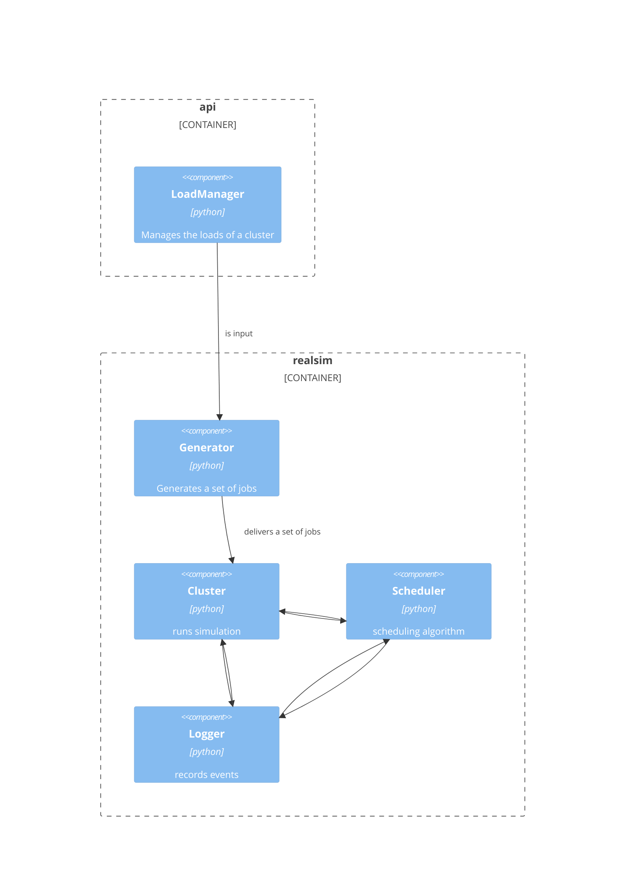

# library "realsim"

A python library to test the possibility of co-scheduling algorithms and their
impact on system performance.

## Purpose
Co-scheduling is considered the best next move for resource management in large
scale supercomputing systems. The main purpose is to test if there is a
(sub)optimal approach to resource sharing among different kind of workloads. The
simulation framework uses the experimental data we gathered on a shallow level
to determine whether a co-scheduling approach is possible and if the performance
benefits are worth the try.

## How do we do it?
We are using the measurements of our experiments to build the virtual workloads
for the simulation. We describe the cluster that these workloads will run in a
higher level, without any hardware simulation involved. This way we can speedup
our simulation and the codebase density is minimal.

## What are the components?
At this time of writing there are different parts that builds up the whole
simulation framework.

For workloads we are using a structure called LoadManager that connects to a
database where all our (work)loads are stored in compressed forms for rapid use.
The LoadManager is a map from an HPC cluster to the different workloads we ran.

To create a set of jobs, the software component, called Generator, generates
through a specific logic (more on that later), a set of jobs using as input the
LoadManager.

The set of jobs can then be deployed to a Cluster. A Cluster is the software
component that encapsulates a waiting queue and an execution list. When
everything is setup, then the Cluster fires up the simulation and produces
results.

In order for the Cluster to be functional, two different structures need to be
available. The Scheduler and the Logger.

The Scheduler holds the logic of the scheduling or co-scheduling algorithm. This
means that whenever we want to try a new idea about how a scheduling algorithm
should handle job admissions and resource allocations, we only need to define a
scheduler.

The Logger is used to record cluster wide or job events. It also has plotting
capabilities for visualizing the simulation's output.

These three components are interconnected because they communicate while the
simulation is running.

The following diagram shows how everything is connected to produce the results
of a simulation.

## What are some future improvements?

1. Dynamic waiting queue deployment of jobs. At the scenarios we are currently
   testing the set of jobs of a cluster is decided at point zero. The next step
   is to reiterate the Generator and Cluster codes to produce simulations with
   dynamically changing waiting queues. (Research)
2. Finding better co-scheduling algorithms. This is always an open problem.
   (Research)
3. Generalize Generator input. At this moment the set of jobs is generated
   through a LoadManager instance. We want to add more immediate methods for
   this. (SoftEng)
4. Implementing hardware level details. This is an extra topic of discussion,
   that would restructure a lot of code to integrate low level details about the
   clusters. (SoftEng)
5. Optimizing simulation for faster results. (SoftEng)
