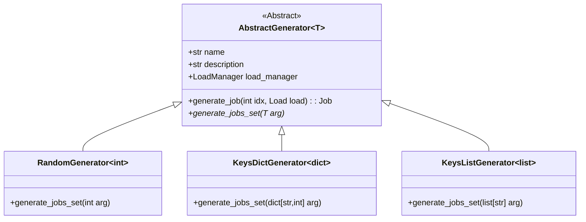

# Generators

Classes used to produce a list of jobs from loads given by a load manager.
The only thing needed to be provided is a load manager. Different sampling
methods of loads are implemented by different concrete classes of the
**AbstractGenerator**. At the moment the implemented classes are:
- **RandomGenerator:** random sampling from a LoadManager instance.
- **KeysDictGenerator:** sample by keys and their frequency of appeareance.
  A dict of keys and their frequency is given.
- **KeysListGenerator:** full sample control. A list of keys determines the
  loads and their placement.

## User Guide

The user decides which generator of jobs to use based on the needs of his
experiment. First a LoadManager instance with the loads loaded should be
created. Afterwards, the instance is given to a generator to produce a set of
jobs.

```python
from api.loader import LoadManager
from realsim.generators.random import RandomGenerator
from realsim.generators.keysdict import KeysDictGenerator
from realsim.generators.keyslist import KeysListGenerator

# Create a LoadManager instance
lm = LoadManager("aris.compute")
# Import all the loads
lm.import_from_db(...)

# Create three different generators of different classes
gen1 = RandomGenerator(lm)
gen2 = KeysDictGenerator(lm)
gen3 = KeysListGenerator(lm)

# RandomGenerator set of jobs
# An integer is given for the population of jobs
set1 = gen1.generate_jobs_set(100)

# KeysShuffledGenerator set of jobs
# A dictionary is given with keys and frequencies
set2 = gen2.generate_jobs_set({
    "sp.D.121": 10,
    "lu.E.1024": 5
})

# KeysStaticGenerator set of jobs
# Full control of frequency and placement of keys in the set
set3 = gen3.generate_jobs_set(["sp.D.121", "cg.E.512", "cg.D.256", "lu.E.512"])
```

## Developer Guide

If someone wants to create a new way to generate a set of jobs then there is an
abstract class called **AbstractGenerator** that has the basic functionalities
all generators need and a blueprint method *generate_jobs_set* for
implementation. The following class diagram shows structure in the package.



