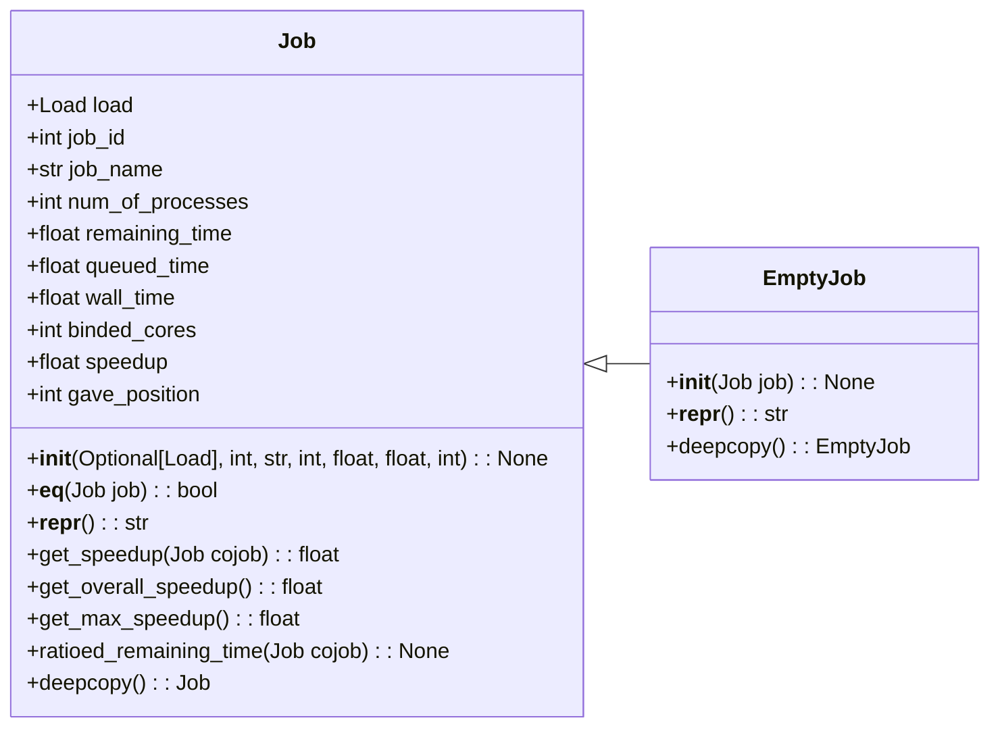

# Jobs

The classes **Job** and **EmptyJob** are defined in this package. An instance of
class **Job** encapsulates an instance of class **Load** and provides additional
information, about resource usage for the simulation. Class **EmptyJob** is
basically a subclass of class **Job** for job instances that have finished
execution. It is necessary because information about the binded cores of a job
is stored.

## User and Developer Guide

These classes are not used as is in the simulation framework. They are the
building blocks.

The next diagram shows the class hierarchy of the package.

