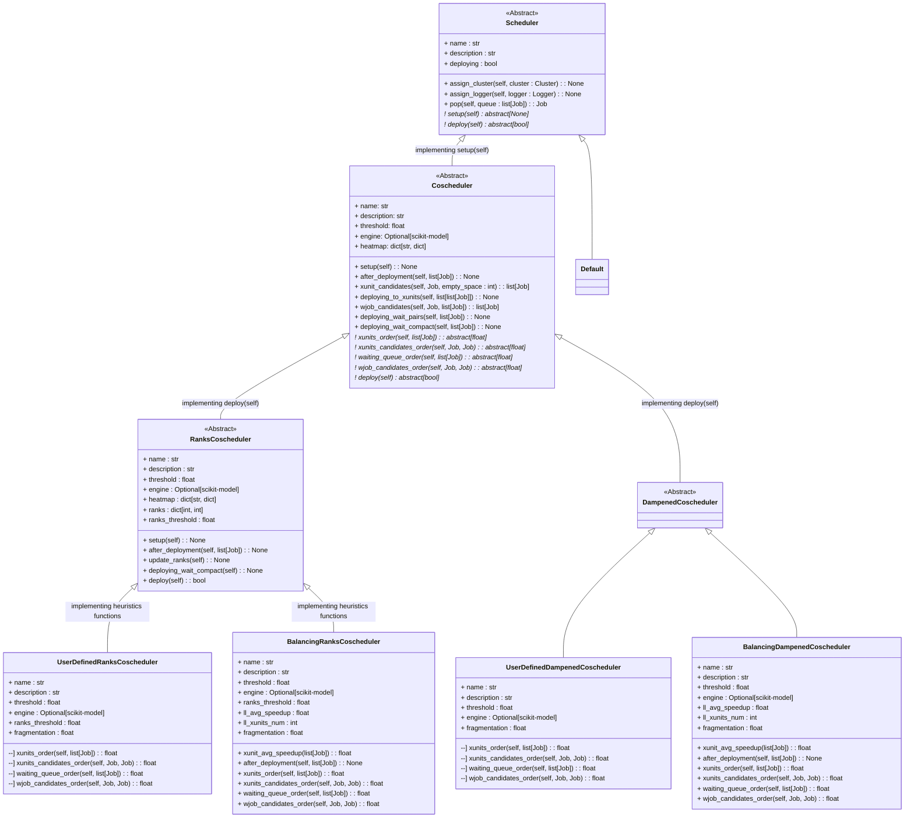

```mermaid

classDiagram

    Scheduler <|-- Coscheduler : implementing setup(self)
    Scheduler <|-- Default

    Coscheduler <|-- RanksCoscheduler : implementing deploy(self)
    Coscheduler <|-- DampenedCoscheduler : implementing deploy(self)

    RanksCoscheduler <|-- UserDefinedRanksCoscheduler : implementing heuristics functions
    RanksCoscheduler <|-- BalancingRanksCoscheduler : implementing heuristics functions

    DampenedCoscheduler <|-- UserDefinedDampenedCoscheduler
    DampenedCoscheduler <|-- BalancingDampenedCoscheduler

    class Scheduler{
        <<Abstract>>
        + name : str
        + description : str
        + deploying : bool
        + assign_cluster(self, cluster : Cluster) : None
        + assign_logger(self, logger : Logger) : None
        + pop(self, queue : list[Job]) : Job
        ! setup(self)* abstract[None]
        ! deploy(self)* abstract[bool]
    }

    class Coscheduler{
        <<Abstract>>
        + name: str
        + description: str
        + threshold: float
        + engine: Optional[scikit-model]
        + heatmap: dict[str, dict]
        + setup(self) : None
        + after_deployment(self, list[Job]) : None
        + xunit_candidates(self, Job, empty_space : int) : list[Job]
        + deploying_to_xunits(self, list[list[Job]]) : None
        + wjob_candidates(self, Job, list[Job]) : list[Job]
        + deploying_wait_pairs(self, list[Job]) : None
        + deploying_wait_compact(self, list[Job]) : None
        
        ! xunits_order(self, list[Job])* : abstract[float]
        ! xunits_candidates_order(self, Job, Job)* : abstract[float]
        ! waiting_queue_order(self, list[Job])* : abstract[float]
        ! wjob_candidates_order(self, Job, Job)* : abstract[float]

        ! deploy(self)* abstract[bool]
    }

    class RanksCoscheduler{
        <<Abstract>>
        + name : str
        + description : str
        + threshold : float
        + engine : Optional[scikit-model]
        + heatmap : dict[str, dict]
        + ranks : dict[int, int]
        + ranks_threshold : float
        + setup(self) : None
        + after_deployment(self, list[Job]) : None
        + update_ranks(self) : None
        + deploying_wait_compact(self) : None
        + deploy(self) : bool
    }

    class DampenedCoscheduler{
        <<Abstract>>
    }

    class UserDefinedRanksCoscheduler{

        + name : str
        + description : str
        + threshold : float
        + engine : Optional[scikit-model]
        + ranks_threshold : float
        + fragmentation : float

        --] xunits_order(self, list[Job]) : float
        --] xunits_candidates_order(self, Job, Job) : float
        --] waiting_queue_order(self, list[Job]) : float
        --] wjob_candidates_order(self, Job, Job) : float
        
    }

    class BalancingRanksCoscheduler{

        + name : str
        + description : str
        + threshold : float
        + engine : Optional[scikit-model]
        + ranks_threshold : float
        + ll_avg_speedup : float
        + ll_xunits_num : int
        + fragmentation : float

        + xunit_avg_speedup(list[Job]) : float
        + after_deployment(self, list[Job]) : None
        + xunits_order(self, list[Job]) : float
        + xunits_candidates_order(self, Job, Job) : float
        + waiting_queue_order(self, list[Job]) : float
        + wjob_candidates_order(self, Job, Job) : float
        
    }

    class UserDefinedDampenedCoscheduler{

        + name : str
        + description : str
        + threshold : float
        + engine : Optional[scikit-model]
        + fragmentation : float

        --] xunits_order(self, list[Job]) : float
        --] xunits_candidates_order(self, Job, Job) : float
        --] waiting_queue_order(self, list[Job]) : float
        --] wjob_candidates_order(self, Job, Job) : float
        
    }

    class BalancingDampenedCoscheduler{

        + name : str
        + description : str
        + threshold : float
        + engine : Optional[scikit-model]
        + ll_avg_speedup : float
        + ll_xunits_num : int
        + fragmentation : float

        + xunit_avg_speedup(list[Job]) : float
        + after_deployment(self, list[Job]) : None
        + xunits_order(self, list[Job]) : float
        + xunits_candidates_order(self, Job, Job) : float
        + waiting_queue_order(self, list[Job]) : float
        + wjob_candidates_order(self, Job, Job) : float
        
    }

```
